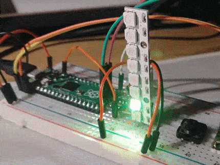

# dancesWithMachines pico ws2812 library

This is the basic library for interacting with ws2812 led strips, written in C. What it really is, is a modified ws2812 example provided by Raspberry Pi team, converted to library. I needed this for my project and I decided I might as well share it, to save somebody the trouble.

**WARNING!**
Library is blocking type, needs about 20ms in between changes.

## How to build example
Open `CMakeLists.txt` and edit `PICO_SDK_PATH`, set your SDK path accordingly.

Next go to `build` directory and run command `cmake ..`

If no errors were reported, you can run `make` command to build the project.

Default pin for led is pin 16 and number of led in led strip is 8. You can edit
`NUM_PIXELS 8` and `WS2812_LEDSTRIP_PIN 16` to match your setup.

## How to add to project
Copy dwm_pico_ws2812 directory (the one inside the repo) to your project, and necessary lines to `CMakeLists.txt` and voila.

Necessary lines to add are marked with `<--` in `CMakeLists.txt`.

## How to use
Every function operates around struct `ledStrip_t`.

Use `ws2812SetupLedStrip()` method to setup led strip and then `ws2812InitLedStrip()` to initiate it.

Use `ws2812PutPixel()` method to light pixel. Every time method is called, next pixel in the row is lit. Thats exactly why **this function is blocking**. To change led pattern approx 20ms must pass in between calls, for pattern to change. Check `ws2812BlockTest()` function in example if you have trouble understanding.

File `example.c` shows how to use the library.

Every function has description added, refer to them for more info.
...also, it is highly encouraged to get familiar with RP2040 pio. This will help you understand what you are actually initiating / setup-ing.

## Licensing
This code is highly based on code provided by Raspberry Pi foundation, as specified in `LICENSE.LIB.txt`.

This library license is specified in `LICENSE.txt` file.

## Notes
I don't plan to actively maintain and develop this code, but if I somehow extend it's functionality in my main project, I will make sure to also post the changes here.

